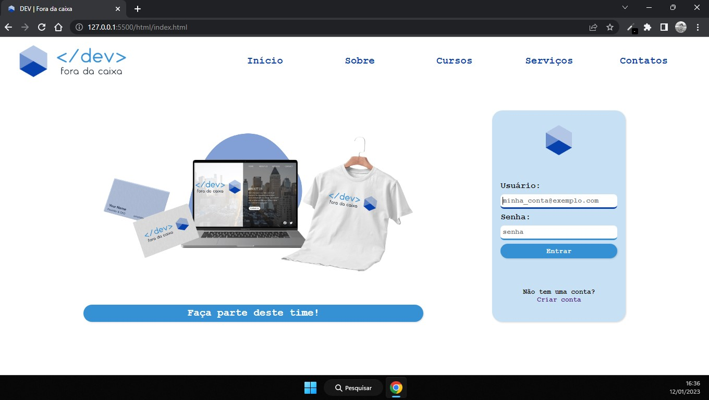
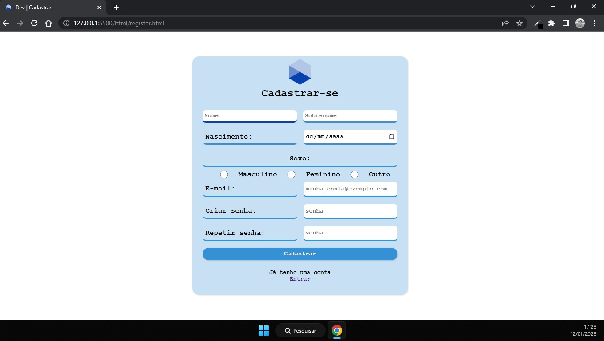
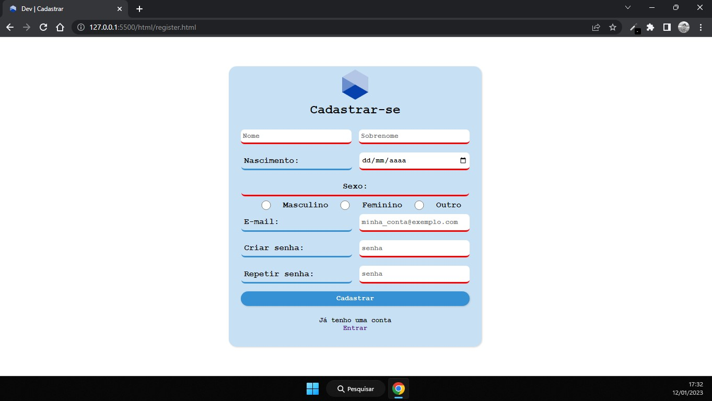
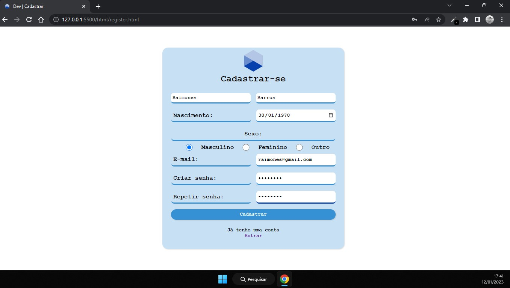
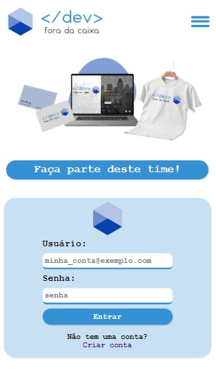
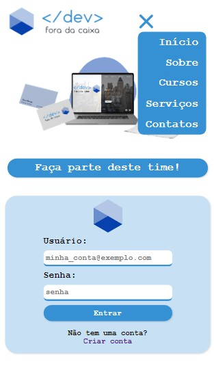
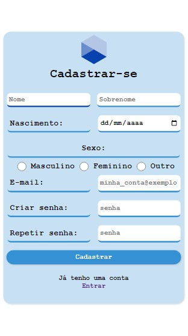

<h1 style="display:flex;">&lt;/dev&gt; fora da caixa</h1>
 
### Projeto de site dinamico, para fins de pratica de conhecimentos e aperfeicoamento de técnicas.

----

## 🛠️ Recursos:
- ### Pagina inicial

Dinâmica de login de usuário;

Inputs de usuário e senha;

Botão de submit;

Link para cadastro;

Botão chamariz para área de cadastro.

*outros recursos desativados. 

- ### Formulário de cadastro

Dinâmica de cadastar novo usuário;

Input de informações pessoais e de futuro login;

Expressão de foco no campo selecionado;

Botão de submit para enviar os dados;

Link para página de login;

Expressão de erro nos campos NÃO preenchidos devidamente ao tentar enviar as informações;

Inclusive semelhança das senhas inseridas e padrão (oito caracteres).

Envio de dados devidamente preenchidos;

----

## ✒️ Design
- ### Simples, minimalista, monocromático, bordas arredendadas e tema light.

----

## 📱 Responsividade

----

## 💻 Tecnologias utilizadas

  

### Foco de estudo: Javascript Orientado a Objetos.   Criação, manipulação, instanciação e visalização de objetos.

----

## ⬆️ Melhorias futuras

- Validar data do formulario para uma idade específica;
- Adicionar caixas de dialogo para melhorar a compreensão das expressões de erro;
- Guardar dados do formulário em banco;
- Usar dados do formulario para login;
- Criar aba de exibição de dados;
- Exibir dados após o login;

----

## ➡️ [Ir para o site]() ⬅️

----