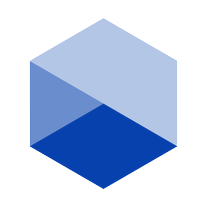
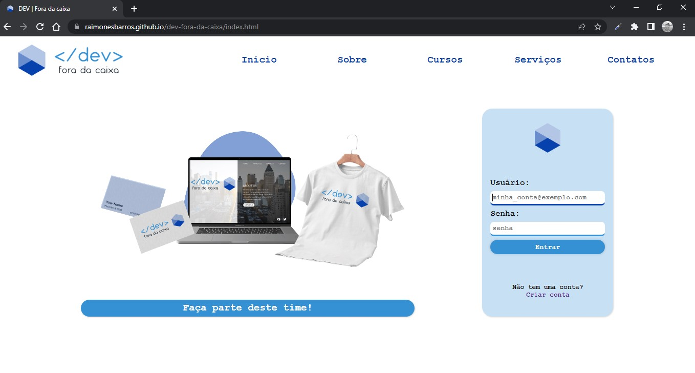
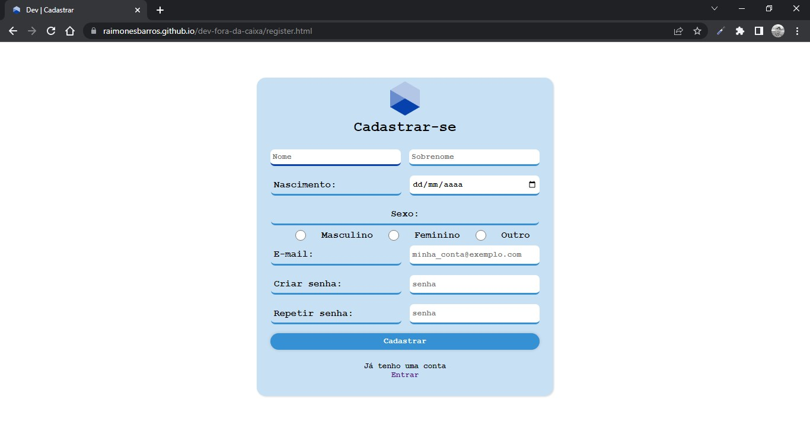
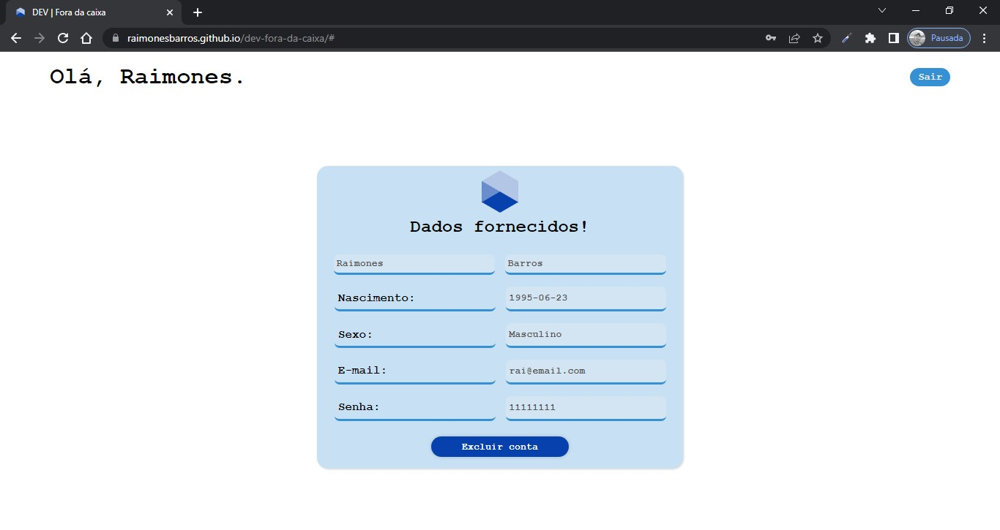
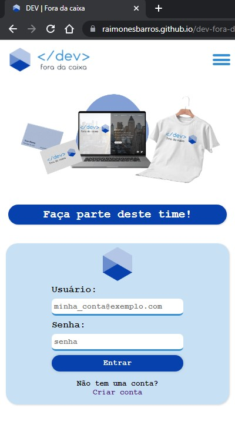
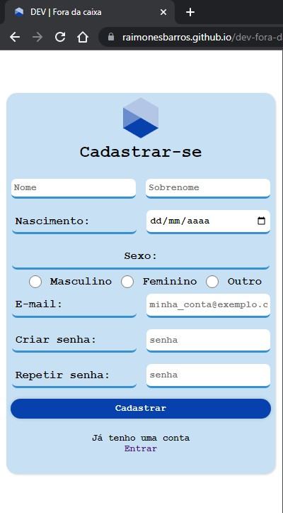
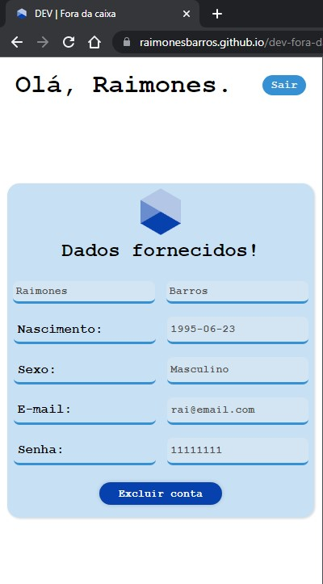

<h1>&lt;/dev&gt; fora da caixa</h1>

 
### Projeto de site dinâmico, para fins de prática de conhecimentos e aperfeiçoamento de técnicas!

----
----

## 🛠️ Recursos:
- ### Página inicial

Dinâmica de login de usuário;

Inputs de usuário e senha;

Botão de submit;

flash messages;

Link para cadastro;

Botão chamariz para área de cadastro.

*outros recursos desativados. 

- ### Formulário de cadastro

Dinâmica de cadastrar novo usuário;

Input de informações pessoais e de futuro login;

Expressão de foco no campo selecionado;

Expressões de inconformidades no cadastro;

flash messages;

Botão de submit para enviar os dados;

Link para página de login;

- ### Acesso por login

Acesso aos dados fornecidos após o login;

Botão sair, para efetuar logoff;

Botão excluir conta.

----

## ✒️ Design
- ### Simples, minimalista, monocromático, bordas arredendadas modelo pílula e tema light.

----

## 📱 Responsividade

----

## 💻 Tecnologias utilizadas

 
 
 com foco em:
 
 

### Foco de estudo: Javascript Orientado a Objetos.   Criação, manipulação, instanciação e visualização de objetos.

----

## ⬆️ Implementar

- Edição de dados do usuário;
- Modo escuro, tema: Dark.

----

## 📖 Abordagens

- Persistência de dados, localStorage;
- POO, MVC, convenções, e abordagens de segurança;
- CRUD;
- JSON: envio, requisição e manipulação;

----

<a href="https://raimonesbarros.github.io/dev-fora-da-caixa/"><button style='padding:.5em; background-color:skyblue; border-radius:.5em; font-weight:bold'> 📤 Acessar Deploy 📤 </button> </a>

----
----
